# Legal Consult Bot

> AI-powered legal consultation system with lawyer review workflow.

A production-ready legal consultation platform where AI generates draft responses, lawyers review and approve them, and users receive professional legal guidance.

## Tech Stack

| Layer | Technology |
|-------|-----------|
| **Frontend** | React 18, TypeScript, Ant Design, Zustand |
| **Backend** | FastAPI, SQLAlchemy (async), LangChain |
| **Database** | PostgreSQL |
| **Vector Store** | Qdrant |
| **AI Models** | DeepSeek, Ollama (local embeddings) |
| **Monitoring** | Prometheus, Grafana, Sentry |
| **Infrastructure** | Docker, Nginx |

## Architecture

```
User → React Frontend → Nginx → FastAPI Backend → PostgreSQL
                                       ↓
                                  LangChain Agent
                                       ↓
                              Qdrant (RAG / Knowledge Base)
                              External APIs (Web Search, MCP)
```

**Workflow:** AI Draft → Lawyer Review → User Visible

## Quick Start

### Prerequisites

- Docker & Docker Compose
- Node.js 18+ (for frontend development)
- Python 3.11+ (for backend development)

### Setup

```bash
# 1. Clone and configure
cp .env.example .env
# Edit .env with your API keys (DeepSeek, etc.)

# 2. Start infrastructure
docker compose up -d postgres qdrant

# 3. Run database migrations
cd backend && alembic upgrade head

# 4. Seed initial data (admin user + roles)
cd backend && python scripts/seed.py

# 5. Start development servers
# Terminal 1 - Backend
cd backend && uvicorn app.main:app --reload --port 8000

# Terminal 2 - Frontend
cd frontend && npm install && npm run dev
```

Or use Docker Compose to run everything:

```bash
docker compose up --build
```

### Default Credentials

After seeding:
- **Email:** admin@legalbot.com
- **Password:** set via `ADMIN_PASSWORD` env var (default: `admin123456`)

## Project Structure

```
├── frontend/          React 18 + TypeScript + Ant Design + Zustand
├── backend/           FastAPI + SQLAlchemy(async) + LangChain
│   ├── api/v1/        Route layer
│   ├── core/          Config / JWT / DB
│   ├── models/        ORM models
│   ├── schemas/       Pydantic request/response schemas
│   ├── services/      Business logic
│   ├── agent/         LangChain Agent + semantic cache
│   └── rag/           Hybrid retrieval + knowledge base ingestion
├── nginx/             Reverse proxy config
├── scripts/           Utility scripts
└── docker-compose.yml Development environment
```

## Key Features

- **Multi-turn conversation** with context-aware AI
- **Lawyer review workflow** — AI drafts, lawyers approve/reject
- **RAG knowledge base** — upload legal documents, hybrid search
- **Role-based access control** — admin, lawyer, user roles
- **MCP protocol support** — connect external AI clients (Cursor, Claude Desktop)
- **Extensible tool system** — web search, sandboxed code execution
- **Monitoring** — Prometheus metrics, Sentry error tracking

## Screenshots

| | |
|---|---|
| 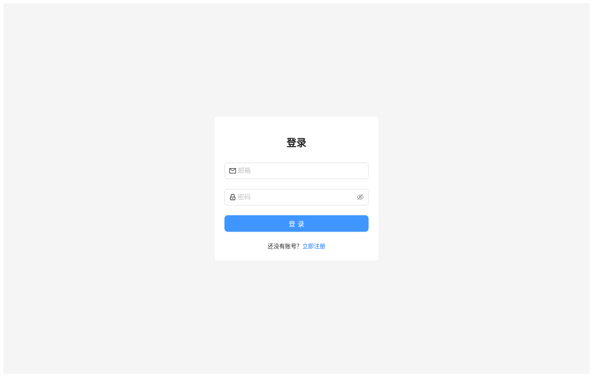 | 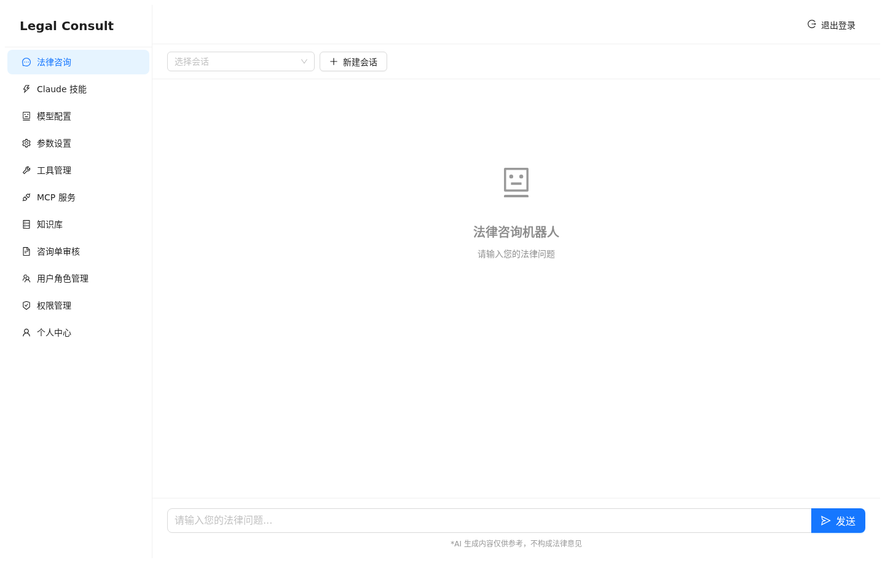 |
| **Login** | **AI Chat Consultation** |
| 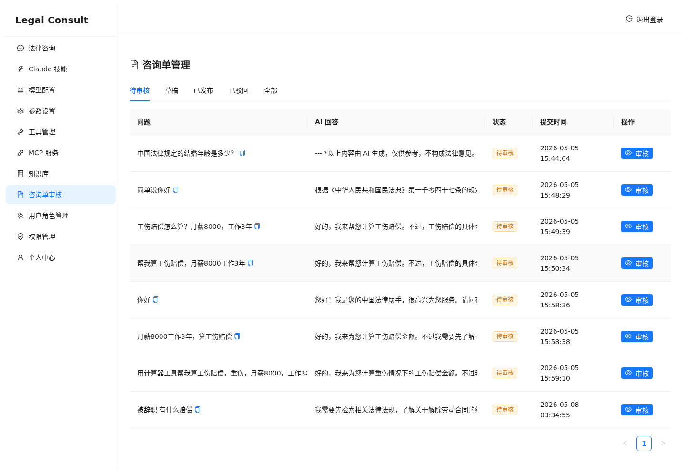 | 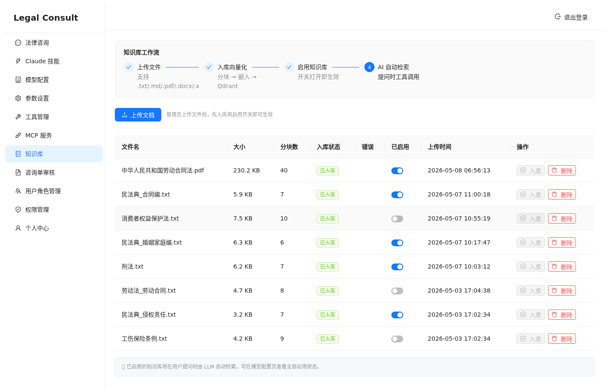 |
| **Consultation Review** | **Knowledge Base** |
| 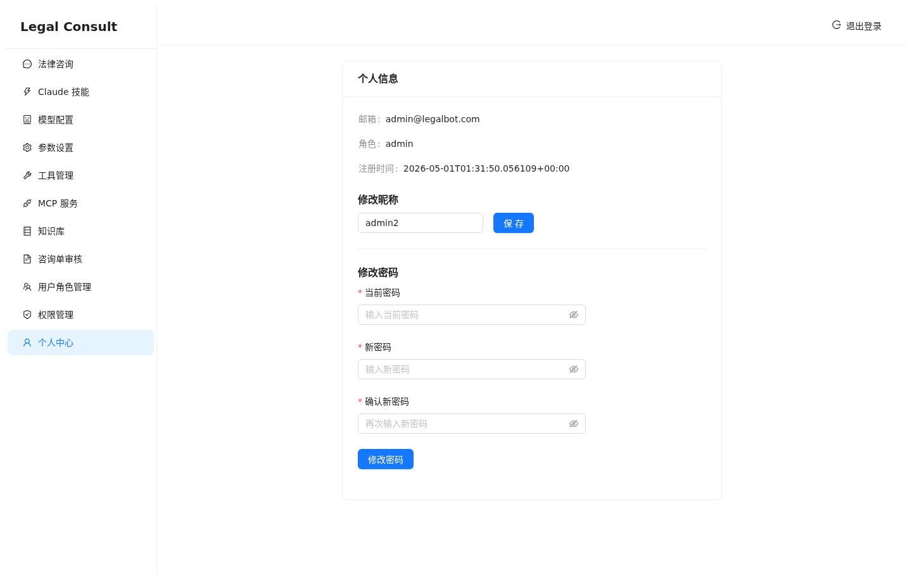 | 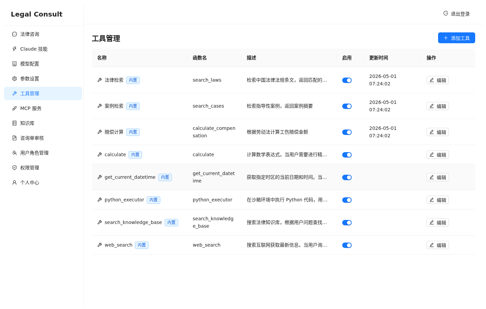 |
| **User Profile** | **Tool Management** |
| 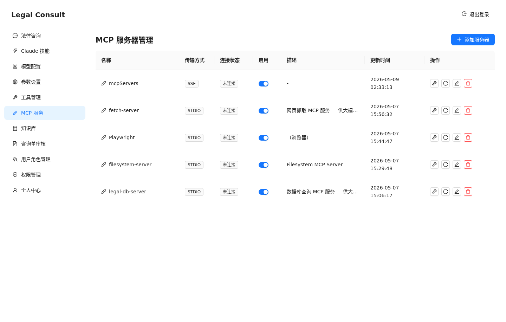 | 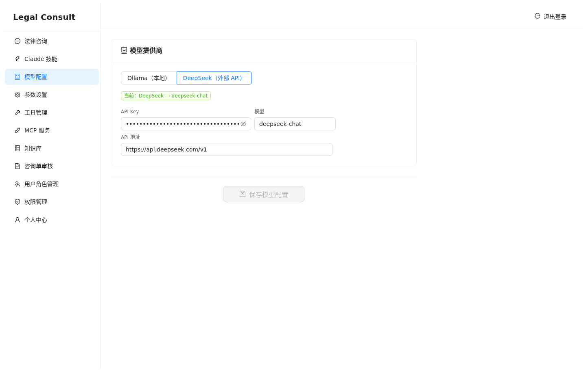 |
| **MCP Server Config** | **Model Settings** |
| 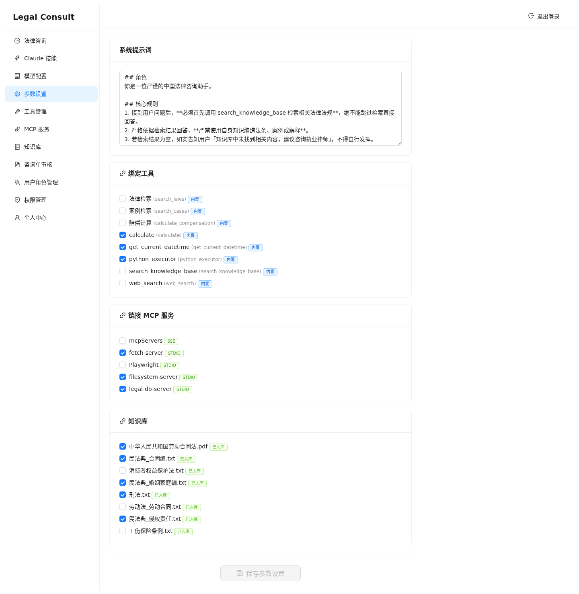 | 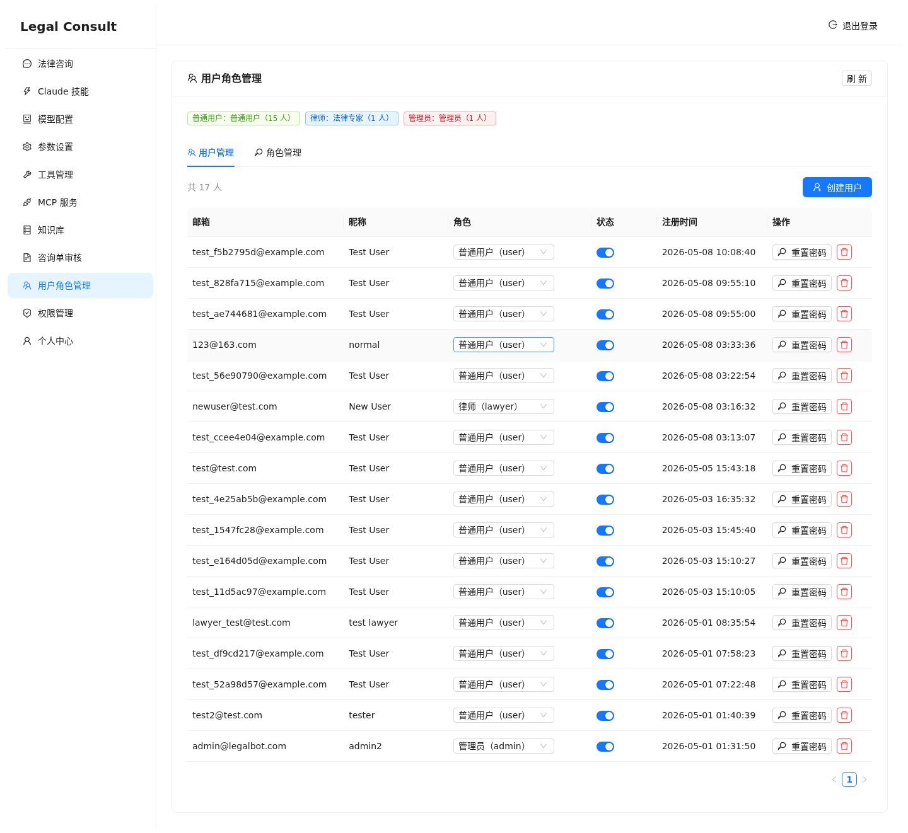 |
| **System Settings** | **User Management** |
| 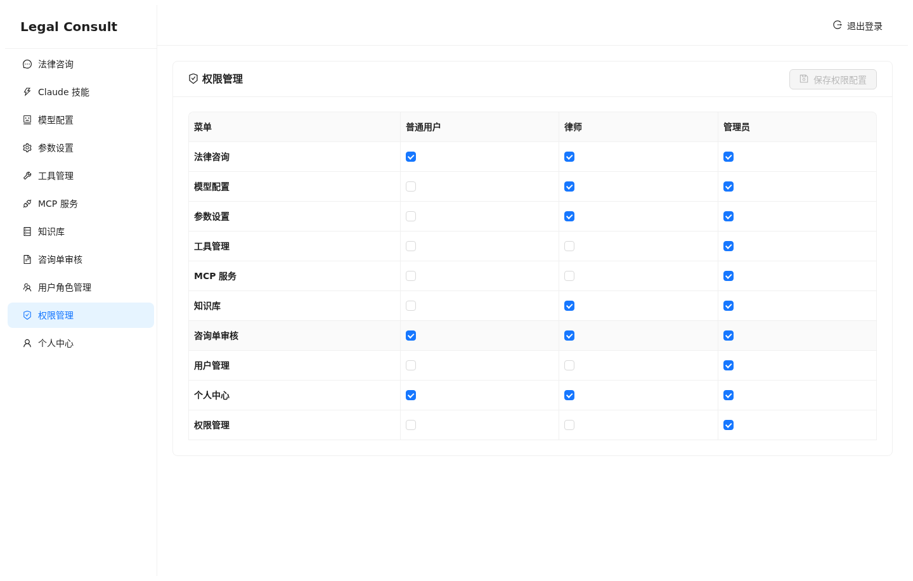 | 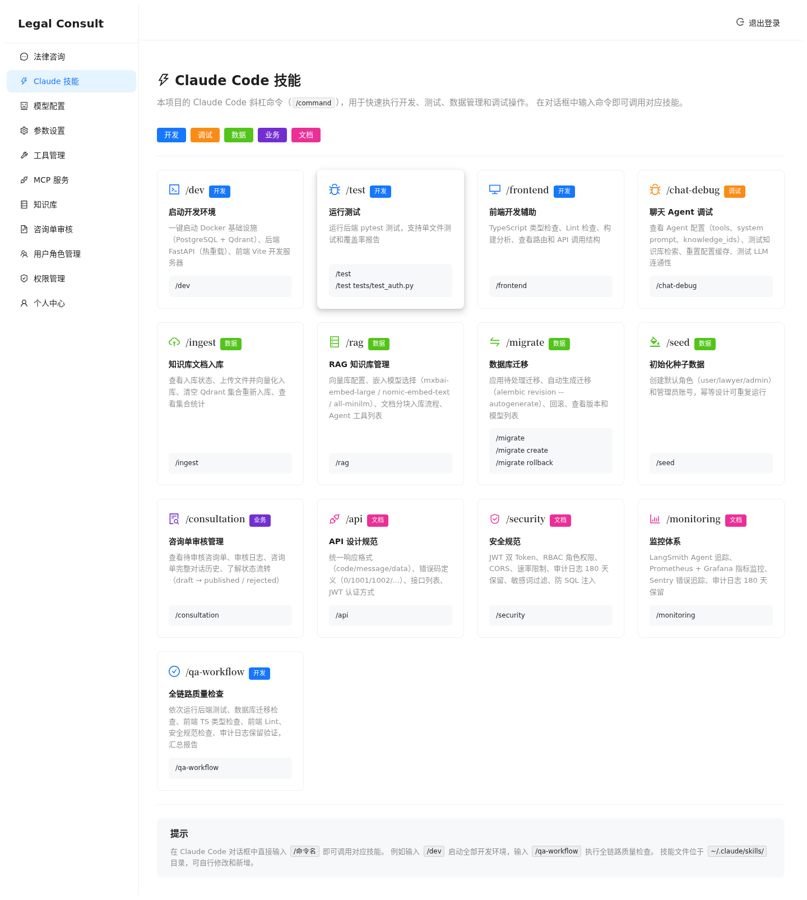 |
| **Permission Management** | **Skill Management** |

## Environment Variables

| Variable | Description |
|----------|-------------|
| `POSTGRES_PASSWORD` | Database password |
| `JWT_SECRET_KEY` | JWT signing key (change in production) |
| `DEEPSEEK_API_KEY` | DeepSeek API key |
| `QDRANT_HOST` | Qdrant vector store host |
| `OLLAMA_BASE_URL` | Ollama server URL for local embeddings |
| `SENTRY_DSN` | Sentry error tracking DSN |
| `ADMIN_PASSWORD` | Default admin password for seeding |

## Development

```bash
# Backend tests
cd backend && pytest -v

# Database migration
cd backend && alembic upgrade head
cd backend && alembic revision --autogenerate -m "description"

# Lint
cd backend && ruff check .
cd frontend && npx eslint src/

# Type check
cd frontend && npx tsc -b
```

## License

MIT
