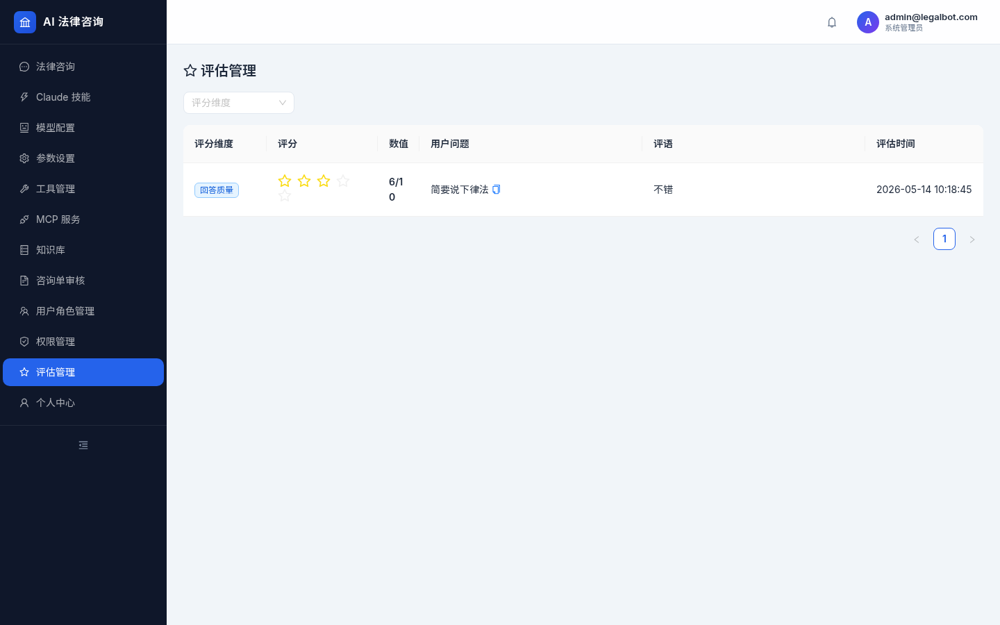

# Legal Consult Bot

> **生产级 AI 法律咨询机器人** — 融合 Agent + RAG + MCP + 人工审核工作流 + 全链路可观测性。

AI 生成回答初稿 → 律师审核发布 → 用户可见。覆盖从知识库构建、Agent 编排、LLM 可观测性到生产化部署的完整 AI 应用链路。

---

## Architecture

```
┌──────────────────────────────────────────────────────────────────────────┐
│                           Frontend (React 18)                             │
│  Ant Design 5 · Zustand 5 · react-markdown · Axios · Sentry              │
│  ┌──────────┐ ┌──────────┐ ┌──────────┐ ┌──────────┐ ┌───────────────┐  │
│  │ Chat     │ │Consult   │ │ Knowledge│ │ MCP/Tools│ │ ModelConfig   │  │
│  │ SSE流式  │ │审核工作流│ │ 文档管理  │ │ 服务器管 │ │ LLM/Agent     │  │
│  │ 多模态   │ │          │ │          │ │ 理       │ │ 参数设置      │  │
│  └──────────┘ └──────────┘ └──────────┘ └──────────┘ └───────────────┘  │
│  ┌──────────┐ ┌──────────┐ ┌──────────┐ ┌──────────┐ ┌───────────────┐  │
│  │ Users    │ │Roles/    │ │Evalu-    │ │ Profile  │ │ Skills/       │  │
│  │ 用户管理 │ │ Perms    │ │ ation    │ │ 个人中心 │ │ 技能管理      │  │
│  └──────────┘ └──────────┘ └──────────┘ └──────────┘ └───────────────┘  │
│  RBAC Route Guards · authStore(JWT) · MarkdownContent · VoiceRecorder   │
│  ImagePreview · AudioPlayer · FileAttachment                             │
└──────────────────────────────────┬───────────────────────────────────────┘
                                   │ HTTP / SSE / Upload
                                   ▼
┌──────────────────────────────────────────────────────────────────────────┐
│                         Nginx Reverse Proxy                               │
│            SSE buffering off · read timeout 300s · CORS · SSL            │
└──────────────────────────────────┬───────────────────────────────────────┘
                                   ▼
┌──────────────────────────────────────────────────────────────────────────┐
│                      FastAPI Backend (Async Python)                       │
│  13 路由模块 ── JWT 认证 · RBAC · SSE 流式 · 速率限制 · 请求校验         │
│  ┌──────┬──────┬──────┬──────┬──────┬──────┬──────┬──────┬──────┬──────┐ │
│  │Auth  │Chat  │Consult│Know-│ MCP  │Users │Tools │Settings│Eval  │Audit│ │
│  │      │      │ation  │ledge│      │      │      │        │uation│Logs │ │
│  ├──────┴──────┴──────┴──────┴──────┴──────┴──────┴──────┴──────┴──────┤ │
│  │  Upload · External MCP · Permissions                                  │ │
│  └──────────────────────────────────────────────────────────────────────┘ │
│                                                                          │
│  ┌──────────────────────────────────────────────────────────────────────┐ │
│  │              LangGraph Agent (CompiledStateGraph)                     │ │
│  │  ChatOpenAI(DeepSeek) · ChatOpenAI(llama.cpp) · ChatOllama           │ │
│  │  ┌──────────────┐  ┌──────────────┐  ┌────────────────────────────┐ │ │
│  │  │ ToolRegistry  │  │  Semantic    │  │  MCP Client Manager        │ │
│  │  │ @tool→BaseTool│  │  Cache       │  │  stdio + SSE transport     │ │
│  │  │ StructuredTool│  │ (嵌入相似度)  │  │  → StructuredTool 包装     │ │
│  │  └──────┬───────┘  └──────────────┘  └────────────┬───────────────┘ │ │
│  └─────────┼──────────────────────────────────────────┼──────────────────┘ │
│            │                                          │                    │
│  ┌─────────▼──────────────────────────────────────────▼──────────────────┐ │
│  │  Hybrid RAG (Qdrant 3-Node Cluster)    MCP Servers                    │ │
│  │  向量检索(k=8) · 关键词匹配 · OCR      内置: fetch/db_query/external  │ │
│  │  RecursiveCharacterTextSplitter        自身暴露为 MCP Server          │ │
│  └──────────────────────────────────────────────────────────────────────┘ │
│                                                                          │
│  ┌──────────────────────────────────────────────────────────────────────┐ │
│  │  多模态处理                                                          │ │
│  │  Image Understanding(Pillow/LLM) · ASR(faster-whisper)               │ │
│  │  Document OCR(PaddleOCR) · 多格式文件提取(PDF/DOCX/XLSX)             │ │
│  └──────────────────────────────────────────────────────────────────────┘ │
│                                                                          │
│  ┌──────────────────────────────────────────────────────────────────────┐ │
│  │  Core Infrastructure                                                 │ │
│  │  config  database  security  langfuse  rate_limit  redis_client      │ │
│  │  metrics  deps(JWT+RBAC)  middleware(敏感词/免责声明)                 │ │
│  └──────────────────────────────────────────────────────────────────────┘ │
└──────────────────────────────────────────────────────────────────────────┘
                    │                    │                    │
         ┌──────────▼──────────┐ ┌──────▼──────┐ ┌──────────▼──────────┐
         │    PostgreSQL 15    │ │    Redis 7   │ │    LLM Providers     │
         │    16 张表          │ │  速率限制    │ │ DeepSeek / Ollama    │
         │    Alembic 迁移     │ │  缓存        │ │ llama.cpp            │
         └─────────────────────┘ └─────────────┘ └─────────────────────┘
                    │                                        │
         ┌──────────▼──────────┐                  ┌──────────▼──────────┐
         │    Qdrant 1.13      │                  │  External API       │
         │  3 节点集群          │                  │  Tavily / DuckDuckGo│
         │  分片数=3 · 副本=2  │                  │                     │
         └─────────────────────┘                  └─────────────────────┘

                          Observability Stack
┌──────────────────────────────────────────────────────────────────────────┐
│  LangFuse(LLM Trace) · Prometheus(Metrics) · Grafana(Dashboards)         │
│  Loki(Logs) · Alertmanager(Alerts) · Sentry(Errors) · Audit Logs(180天)  │
└──────────────────────────────────────────────────────────────────────────┘
```

---

## 核心能力

### AI Agent 引擎

基于 `langchain.agents.create_agent` 构建的 LangGraph `CompiledStateGraph` 状态图，通过 `recursion_limit=25` 控制工具调用深度。

**LLM 抽象层**：DeepSeek / llama.cpp 通过 `langchain_openai.ChatOpenAI`，Ollama 通过 `langchain_ollama.ChatOllama`，经由 `BaseLanguageModel` 接口统一，`_build_llm()` 工厂按 provider 切换。运行时通过前端配置中心动态切换。

**DeepSeek 深度定制**：自定义 `_DeepSeekChatOpenAI` 继承 `ChatOpenAI`，重写 `_convert_chunk_to_generation_chunk` 钩子捕获 `reasoning_content`，实现推理链路前端渲染——深入 LangChain 源码层的定制。

**工具系统**：通过统一 `ToolRegistry` 聚合三类来源：

| 工具来源 | 数量 | LangChain 抽象 | 示例 |
|---------|------|---------------|------|
| 内置工具 | 6 个 | `@tool` 装饰器 → `BaseTool` | 知识库检索、联网搜索、法律赔偿计算、Python沙箱执行、数学计算、日期时间 |
| 自定义工具 | 动态 | `StructuredTool.from_function()` | 通过管理后台注册的自定义函数 |
| MCP 工具 | 动态 | MCP json-schema → `StructuredTool` | 外部服务工具 |

支持运行时动态修改系统提示词和激活的工具列表。配置缓存在 `agent/config.py` 的内存缓存中，启动时从数据库同步。

`[create_agent]` `[LangGraph]` `[_DeepSeekChatOpenAI]` `[@tool]` `[ToolRegistry]` `[BaseLanguageModel]`

### 混合检索 RAG

- **向量检索**：Qdrant 3 节点集群，`shard_number=3`, `replication_factor=2`，稠密向量检索（k=8），结果以 `Document` 对象承载
- **关键词匹配**：法条编号精确匹配，中文数字→阿拉伯数字自动转换
- **文本分块**：`RecursiveCharacterTextSplitter(chunk_size=400, chunk_overlap=50)` 智能递归分块
- **嵌入模型**：`OllamaEmbeddings` + `@lru_cache(maxsize=256)` 层（mxbai-embed-large / nomic-embed-text / all-minilm 三模型可选）
- **多格式文档入库**：支持 PDF（含 OCR 扫描件 via PaddleOCR）、DOCX（含 .doc 回退 via antiword）、XLSX、TXT、MD

`[Qdrant Cluster]` `[RecursiveCharacterTextSplitter]` `[Document]` `[Hybrid Retrieval]` `[OCR]`

### 多模态能力

- **图片理解**：用户发送图片，后端通过 Pillow 处理 + LLM 视觉能力分析，前端 `ImagePreview` 组件展示
- **语音输入**：前端 `VoiceRecorder` 组件录制音频（MediaRecorder API）→ `faster-whisper` 转写为文本 → 送入对话
- **文件附件**：支持多格式附件上传，前端 `FileAttachment` 按 MIME 类型分块展示，`AudioPlayer` 播放语音消息
- **文件类型自动检测**：`file_processing.py` 根据 MIME + 扩展名自动区分 image / document / audio，路由到对应处理管道

`[Image Understanding]` `[ASR]` `[VoiceRecorder]` `[faster-whisper]` `[Pillow]`

### MCP 协议集成

内置 **MCP Client Manager**，同时管理多个 MCP Server 连接：
- **stdio 传输**：本地子进程通信
- **SSE 传输**：远程 HTTP 服务（含独立 SSE 路由 `/api/v1/external-mcp/sse`）
- **工具自动发现**：MCP 工具的 JSON Schema `inputSchema` → Pydantic 模型自动转换，包装为 `StructuredTool(name, description, args_schema, coroutine)` 注册到 `ToolRegistry`
- **自身暴露为 MCP Server**：`mcp_servers/external_api_server.py` 通过 FastMCP 将法律咨询机器人封装为 MCP Server，支持 Cursor、Claude Desktop 等 MCP Client 反向连接
- **内置 MCP Servers**：`fetch_server.py`（网页抓取）、`db_server.py`（PostgreSQL 只读查询）

`[MCP]` `[StructuredTool]` `[ToolRegistry]` `[MCP Client]` `[MCP Server]`

### 审核工作流

```
用户提问 → AI 生成草稿 → 律师审核 → [发布] → 用户可见
                                  → [拒绝 + 评分] → 退回重审
```

- 多维度评分体系（通过 LangFuse Evaluation API 持久化，含评分名称管理）
- LangFuse Trace 全链路追踪（含模型、Token 消耗、延迟）
- 完善的会话→消息→咨询单关联
- 前端 `/evaluations` 页面提供评分查询与可视化

`[Review Workflow]` `[Human-in-the-Loop]` `[LangFuse Evaluation]`

### 全链路可观测性

| 维度 | 工具 | 覆盖范围 |
|------|------|---------|
| LLM 追踪 | **LangFuse** | Agent 调用链路、Token 消耗、评分回传 |
| 指标监控 | **Prometheus + Instrumentator** | QPS、延迟、错误率、自定义业务指标 |
| 可视化 | **Grafana** | Prometheus + Loki 数据源预配置，大盘 JSON 预置 |
| 日志聚合 | **Loki + Promtail** | Docker 容器日志、JSON 结构化应用日志 |
| 告警 | **Alertmanager** | 与 Prometheus 联动配置 |
| 错误追踪 | **Sentry** | FastAPI + 前端集成，自动捕获异常 |
| 操作审计 | **audit_logs 表** | 所有管理操作记录，180 天保留（启动时自动清理） |

自定义 Prometheus 指标：`legal_bot_requests_total`（请求计数）、`legal_bot_errors_total`（错误计数）、`legal_bot_audit_log_cleanup_total`（审计日志清理计数）。

`[Observability]` `[Grafana]` `[Sentry]` `[Loki]` `[Alertmanager]`

### RBAC 权限体系

三角色模型 + 菜单级权限控制 + 权限矩阵管理页面：

| 角色 | 权限 | 典型操作 |
|------|------|---------|
| 管理员 | 全部权限 | 用户管理、系统配置、MCP 管理、角色分配、权限矩阵编辑 |
| 律师 | 业务操作 | 审核咨询单、管理知识库、查看评分、LLM 配置、Agent 参数 |
| 普通用户 | 基础操作 | 提问（含多模态）、查看会话、个人资料、技能管理 |

前端路由由 `ProtectedRoute`（认证）+ `RoleGuard`（角色）双重保护，后端通过 `require_role()` 依赖注入校验。菜单可见性由 `role_menus` 表控制，管理员可在 `/permissions` 页面运行时调整角色-菜单映射。

`[RBAC]` `[Role-based Access]` `[Audit Trail]` `[Permission Matrix]`

### 流式对话与推理展示

- **SSE Streaming**：前端通过 `fetch()` + `ReadableStream.getReader()` 逐 token 读取，后端 `agent.astream(inputs, stream_mode="messages")` 按 `langgraph_node` 元数据路由
- **工具调用流式块**：监听 `chunk.tool_call_chunks` 实时渲染 Agent 工具调用状态
- **DeepSeek 推理展示**：自定义 `_DeepSeekChatOpenAI` 重写 `_convert_chunk_to_generation_chunk` 捕获 `delta.reasoning_content`，前端独立渲染思考链路
- **多模态消息渲染**：支持图片预览（`ImagePreview`）、音频播放（`AudioPlayer`）、文件附件展示（`FileAttachment`）
- **Markdown 渲染**：`MarkdownContent` 组件基于 react-markdown + remark-gfm，支持代码块深色主题、表格、引用块
- **LLM Provider 热切换**：通过 `BaseLanguageModel` 接口统一，运行时可切换 DeepSeek / Ollama / llama.cpp
- **联网搜索开关**：用户可控制是否启用 Web Search

`[agent.astream]` `[stream_mode=messages]` `[tool_call_chunks]` `[SSE]` `[_DeepSeekChatOpenAI]`

### 前端配置中心

管理员可在运行态动态调整（无需重启后端）：
- **LLM 配置**：Provider 切换、模型名、API Key、API Base
- **Agent 配置**：系统提示词、激活工具列表、知识库开关、MCP 开关
- **Ollama 模型探测**：自动列出可用模型和嵌入模型（`/settings/ollama-models`）
- **统一配置接口**：`GET/PUT /settings/unified` 一次获取/更新所有配置

`[Runtime Config]` `[Dynamic Switching]` `[Unified Config]`

---

## LangChain 深度集成

项目基于 LangChain 0.3 生态构建，从 Agent 编排到向量检索贯穿全链路：

| LangChain 包 | 核心类/函数 | 使用场景 |
|-------------|------------|---------|
| `langchain.agents` | `create_agent` | LangGraph Agent 工厂，工具调用循环状态图 |
| `langchain_openai` | `ChatOpenAI` | DeepSeek / llama.cpp LLM Provider（自定义子类 `_DeepSeekChatOpenAI`） |
| `langchain_ollama` | `ChatOllama` | Ollama 本地 LLM Provider |
| `langchain_core.tools` | `@tool`, `BaseTool`, `StructuredTool` | 内置工具定义、自定义与 MCP 工具动态包装 |
| `langchain_core.messages` | `HumanMessage`, `AIMessage`, `SystemMessage`, `ToolMessage` | 对话历史重建、Agent 输入协议、结果提取 |
| `langchain_qdrant` | `QdrantVectorStore` | 向量存储与语义检索 |
| `langchain_text_splitters` | `RecursiveCharacterTextSplitter` | 文档智能递归分块 |
| `langchain_community.embeddings` | `OllamaEmbeddings` | 本地嵌入模型 + LRU 缓存 |
| `langchain_core.documents` | `Document` | 检索结果元数据承载 |
| `langchain_core.language_models` | `BaseLanguageModel` | 多 Provider 统一 LLM 接口 |

---

## Tech Stack

| 层级 | 技术 | 选型理由 |
|------|------|---------|
| **Frontend** | React 18 + TypeScript + Ant Design 5 + Zustand 5 + react-markdown 10 | SPA 架构、类型安全、企业级组件库、轻量状态管理、Markdown 渲染 |
| **Backend** | FastAPI + SQLAlchemy 2.0 (async) + Pydantic v2 | 异步高性能、类型化 ORM、声明式验证 |
| **AI Agent** | LangChain 0.3（8 子包）+ LangGraph + MCP SDK 1.0 | Agent 工厂、LLM 抽象、工具系统、消息协议、RAG 集成 |
| **Vector Store** | Qdrant 1.13 集群（3 节点） + Ollama Embeddings | 高性能向量检索、本地化嵌入、多模型、高可用 |
| **Database** | PostgreSQL 15 + Alembic + Redis 7 | 成熟稳定、异步驱动、版本化迁移、缓存/速率限制 |
| **LLM Providers** | DeepSeek API + Ollama + llama.cpp + faster-whisper | 云+本地双模式、运行时可切换、语音转写 |
| **Multi-modal** | Pillow + PaddleOCR + faster-whisper | 图片理解、文档 OCR、语音识别 |
| **Monitoring** | Prometheus + Grafana + Loki + Alertmanager + Sentry | 指标+日志+告警+错误四位一体 |
| **LLM Observability** | LangFuse v2（自建 REST 客户端） | Trace + Evaluation 全链路追踪 |
| **Infrastructure** | Docker Compose + Nginx + Kubernetes | 环境一致性、反向代理、SSE 优化、容器编排 |
| **Security** | JWT (HS256) + bcrypt + RBAC + Audit Log + slowapi | 令牌轮换、密码哈希、角色控制、操作审计、速率限制 |

---

## Project Structure

```
├── backend/
│   ├── api/
│   │   ├── v1/                          # 路由层 — 13 个路由模块
│   │   │   ├── auth.py                  # 登录/注册/令牌刷新/修改密码
│   │   │   ├── chat.py                  # 会话管理 + SSE 流式对话
│   │   │   ├── consultations.py         # 咨询单审核工作流
│   │   │   ├── knowledge.py             # 知识库文档管理
│   │   │   ├── mcp.py                   # MCP Server CRUD + 测试/开关
│   │   │   ├── users.py                 # 用户/角色 CRUD + 密码管理
│   │   │   ├── settings.py              # LLM/Agent 运行时配置
│   │   │   ├── tools.py                 # 自定义工具 CRUD
│   │   │   ├── permissions.py           # 权限矩阵管理
│   │   │   ├── evaluations.py           # 评分查询
│   │   │   ├── audit.py                 # 审计日志查询
│   │   │   ├── upload.py                # 文件上传/语音转写/附件下载
│   │   │   ├── external_mcp.py          # 外部 MCP SSE 端点
│   │   │   └── __init__.py              # 聚合路由
│   │   └── deps.py                      # 认证 + RBAC 依赖注入
│   ├── agent/                           # AI Agent 核心
│   │   ├── agent.py                     # LangGraph Agent 工厂 (_DeepSeekChatOpenAI)
│   │   ├── tools.py                     # 6 个内置工具
│   │   ├── registry.py                  # 统一工具注册表
│   │   ├── mcp_client.py                # MCP Client 管理器
│   │   ├── cache.py                     # 语义缓存（嵌入相似度）
│   │   ├── sandbox.py                   # Python 沙箱执行器
│   │   └── config.py                    # 运行时配置内存缓存
│   ├── rag/                             # RAG 流水线
│   │   ├── embeddings.py                # 嵌入模型（LRU 缓存）
│   │   ├── ingest.py                    # 多格式文档入库
│   │   └── retriever.py                 # 混合检索（向量+关键词）
│   ├── models/                          # SQLAlchemy ORM — 16 张表
│   │   ├── user.py                      # User, Role
│   │   ├── session.py                   # 会话
│   │   ├── message.py                   # 消息
│   │   ├── consultation.py              # 咨询单
│   │   ├── evaluation.py                # 评分
│   │   ├── knowledge.py                 # 知识库文档
│   │   ├── mcp_server.py                # MCP Server
│   │   ├── tool.py                      # 自定义工具
│   │   ├── setting.py                   # 系统设置
│   │   ├── audit.py                     # 审计日志
│   │   ├── qa.py                        # Q&A 历史
│   │   ├── token.py                     # 刷新令牌
│   │   ├── attachment.py                # 附件
│   │   ├── role_menu.py                 # 角色菜单映射
│   │   └── ...                          # 其他模型
│   ├── schemas/                         # Pydantic 请求/响应
│   ├── services/                        # 业务逻辑（审计、评分）
│   ├── core/                            # 基础设施
│   │   ├── config.py                    # 配置（pydantic-settings）
│   │   ├── database.py                  # 异步 SQLAlchemy
│   │   ├── security.py                  # JWT + bcrypt
│   │   ├── langfuse.py                  # LangFuse REST 客户端
│   │   ├── rate_limit.py                # slowapi 限流器
│   │   ├── redis_client.py              # Redis 异步连接池
│   │   └── metrics.py                   # 自定义 Prometheus 指标
│   ├── middleware/                       # 中间件
│   │   ├── sensitive.py                 # 敏感词过滤
│   │   └── disclaimer.py                # 免责声明追加
│   ├── mcp_servers/                      # 内置 MCP Server
│   │   ├── external_api_server.py        # 暴露自身为 MCP Server
│   │   ├── fetch_server.py              # 网页抓取
│   │   └── db_server.py                 # 数据库查询
│   ├── utils/
│   │   └── file_processing.py           # 文件类型检测/文本提取/OCR
│   ├── alembic/versions/                # 9 个数据库迁移
│   ├── scripts/                         # 运维脚本
│   │   ├── seed.py                      # 初始化种子数据
│   │   ├── cleanup_audit_logs.py        # 审计日志清理
│   │   ├── migrate_doc_ids.py           # 文档 ID 迁移
│   │   ├── recreate_qdrant.py           # 重建 Qdrant 集合
│   │   └── restart-backend.sh           # 后端重启
│   ├── tests/                           # 测试
│   └── data/                            # 法律文档样本
├── frontend/
│   ├── src/
│   │   ├── pages/                       # 14 个页面
│   │   │   ├── auth/                    # Login, Register
│   │   │   ├── chat/                    # ChatPage (SSE 流式 + 多模态)
│   │   │   ├── consultation/            # 咨询单审核
│   │   │   ├── evaluation/              # 评分查询
│   │   │   ├── knowledge/               # 知识库管理
│   │   │   ├── mcp/                     # MCP 服务器管理
│   │   │   ├── models/                  # LLM 模型配置
│   │   │   ├── permissions/             # 权限矩阵
│   │   │   ├── profile/                 # 个人中心
│   │   │   ├── settings/                # Agent 参数设置
│   │   │   ├── skills/                  # 技能管理
│   │   │   ├── tools/                   # 工具管理
│   │   │   └── users/                   # 用户/角色管理
│   │   ├── api/                         # 11 个 API 调用模块
│   │   ├── stores/                      # Zustand 状态管理 (authStore)
│   │   ├── router/                      # 路由 + ProtectedRoute + RoleGuard
│   │   ├── components/
│   │   │   ├── MarkdownContent.tsx       # Markdown 渲染
│   │   │   └── chat/
│   │   │       ├── VoiceRecorder.tsx    # 语音录制 + ASR
│   │   │       ├── ImagePreview.tsx     # 图片预览
│   │   │       ├── AudioPlayer.tsx      # 音频播放器
│   │   │       └── FileAttachment.tsx   # 文件附件展示
│   │   ├── layouts/                     # MainLayout (侧边栏 + 顶栏)
│   │   └── types/                       # TypeScript 类型定义
│   └── package.json
├── scripts/make.sh                      # 开发工作流入口
├── docker-compose.yml                   # 开发环境（14 个服务）
├── docker-compose.prod.yml              # 生产环境
├── docker-compose.qdrant-cluster.yml    # Qdrant 集群配置
├── nginx/                               # Nginx 配置（开发/生产）
├── k8s/                                 # Kubernetes 部署配置
│   ├── deployment.yaml                  # 部署
│   ├── configmap.yaml                   # 配置映射
│   ├── secret.yaml                      # 密钥
│   ├── hpa.yaml                         # 自动扩缩容
│   └── ingress.yaml                     # 入口
├── grafana/
│   ├── dashboards/                      # 预配置大盘 (legal-bot-overview.json)
│   └── provisioning/                    # 自动数据源配置
├── prometheus.yml                       # Prometheus 配置
├── alertmanager.yml                     # Alertmanager 告警配置
├── promtail.yml                         # Promtail 日志采集
└── loki/                                # Loki 配置
```

---

## Quick Start

### 一键启动（完整环境）

```bash
docker compose up --build -d
```

包含全部 14 个服务：PostgreSQL + Qdrant 3 节点集群 + Redis + Backend + Frontend + Nginx + Prometheus + Grafana + Loki + Promtail + LangFuse。

### 分步启动（适合开发调试）

```bash
# 1. 启动基础设施（Docker）
bash scripts/make.sh dev
# 或手动：docker compose up -d postgres qdrant-node-0 qdrant-node-1 qdrant-node-2 redis \
#                prometheus grafana loki promtail langfuse

# 2. 配置环境变量
cp .env.example .env
# 编辑 .env 填入 API Key（DeepSeek / Tavily / Sentry 等）

# 3. 应用数据库迁移
cd backend && alembic upgrade head

# 4. 初始化种子数据（角色 + 管理员账号）
cd backend && python scripts/seed.py

# 5. 启动后端（热重载, http://localhost:8888）
cd backend && uvicorn app.main:app --reload --port 8888

# 6. 启动前端（新终端, http://localhost:5173）
cd frontend && npm install && npm run dev
```

### 默认账号

| 角色 | Email | 密码 |
|------|-------|------|
| 管理员 | admin@legalbot.com | `admin123456`（通过 `ADMIN_PASSWORD` 覆盖） |

### 常用命令

```bash
bash scripts/make.sh test        # 运行后端测试
bash scripts/make.sh seed        # 初始化种子数据
bash scripts/make.sh migration msg="description"  # 生成数据库迁移
bash scripts/make.sh clean       # 清理缓存
```

---

## Screenshots

| | |
|---|---|
|  |  |
| **登录注册** | **AI 对话** — 流式输出 + 工具调用 + 推理展示 + 多模态 |
|  |  |
| **咨询单审核** — AI草稿 → 律师审核 | **知识库管理** — 文档上传与入库 |
|  |  |
| **MCP 服务器** — 前沿协议集成 | **LLM 配置** — 多 Provider 切换 |
|  |  |
| **Agent 参数** — 运行时动态配置 | **工具管理** — 内置+自定义+MCP |
|  |  |
| **用户管理** — RBAC 权限控制 | **菜单权限** — 基于角色 |
|  |  |
| **个人中心** — 资料编辑 | **技能管理** |
|  | |
| **评分查询** — LangFuse Evaluation 多维评分 | |

---

## 生产化特性

| 特性 | 实现 |
|------|------|
| 健康检查 | FastAPI `/health` / `/healthz` / `/readyz` 端点 + Docker Compose 健康检测 |
| 优雅关闭 | Uvicorn 优雅退出 + MCP 断开 + Redis 连接池清理 |
| 错误追踪 | Sentry SDK 自动捕获（后端 + 前端） |
| 指标监控 | Prometheus FastAPI Instrumentator + 自定义业务指标（QPS/延迟/错误率） |
| 日志聚合 | JSON 结构化日志 + Lokistack（Docker 日志 + 应用日志 + Nginx 日志）|
| Grafana 大盘 | Prometheus + Loki 数据源预配置，大盘 JSON 文件预置 |
| 告警 | Alertmanager + Prometheus 告警规则 |
| 速率限制 | slowapi + Redis 后端（聊天端点限流） |
| 安全审计 | 所有管理操作写入 audit_logs（180 天保留，启动时自动清理）|
| 令牌安全 | JWT 访问令牌（8h）+ 刷新令牌轮换（30d），bcrypt 存储 |
| 输入校验 | Pydantic v2 全接口校验 + 请求体大小限制 |
| CORS | 开发环境宽松，生产环境严格配置 |
| Redis 缓存 | 异步 Redis 连接池（速率限制后端 + 通用缓存） |
| 沙箱隔离 | Python 代码执行：子进程 + 静态分析 + 30s 超时 |
| 敏感词过滤 | 中间件层拦截（仅保护注册/登录接口，法律术语豁免） |
| 免责声明 | 中间件强制追加 |
| 容器化 | Docker Compose 多阶段构建、环境分离（开发/生产） |
| K8s 部署 | Deployment + HPA + ConfigMap + Secret + Ingress |

---

## API 概览

| Method | Endpoint | Description |
|--------|----------|-------------|
| `POST` | `/api/v1/auth/login` | 用户登录，返回 JWT |
| `POST` | `/api/v1/auth/register` | 用户注册 |
| `POST` | `/api/v1/auth/refresh` | 刷新令牌 |
| `POST` | `/api/v1/me/password` | 修改密码 |
| `POST` | `/api/v1/chat/sessions` | 创建会话 |
| `GET` | `/api/v1/chat/sessions` | 会话列表 |
| `POST` | `/api/v1/chat/ask` | 非流式对话 |
| `POST` | `/api/v1/chat/stream` | SSE 流式对话 |
| `POST` | `/api/v1/chat/upload` | 文件上传 |
| `POST` | `/api/v1/chat/transcribe/{id}` | 语音转写 |
| `GET` | `/api/v1/chat/download/{id}` | 下载附件 |
| `GET` | `/api/v1/consultations` | 咨询单列表 |
| `GET` | `/api/v1/consultations/pending` | 待审核咨询单 |
| `POST` | `/api/v1/consultations/{id}/review` | 审核发布/拒绝 |
| `GET` | `/api/v1/knowledge/documents` | 文档列表 |
| `POST` | `/api/v1/knowledge/ingest/{id}` | 文档入库 |
| `GET` | `/api/v1/users` | 用户列表（管理员） |
| `POST` | `/api/v1/users` | 创建用户（管理员） |
| `PUT` | `/api/v1/users/{id}` | 编辑用户 |
| `PUT` | `/api/v1/users/{id}/password` | 重置密码 |
| `GET` | `/api/v1/users/roles` | 角色列表 |
| `POST` | `/api/v1/users/roles` | 创建角色 |
| `PUT` | `/api/v1/users/roles/{id}` | 编辑角色 |
| `GET` | `/api/v1/mcp/servers` | MCP 服务器列表 |
| `POST` | `/api/v1/mcp/servers` | 注册 MCP 服务器 |
| `PUT` | `/api/v1/mcp/servers/{id}` | 更新 MCP 服务器 |
| `POST` | `/api/v1/mcp/servers/{id}/toggle` | 开关 MCP 服务器 |
| `GET` | `/api/v1/tools` | 工具列表 |
| `POST` | `/api/v1/tools` | 注册自定义工具 |
| `GET` | `/api/v1/settings/llm` | 获取 LLM 配置 |
| `PUT` | `/api/v1/settings/llm` | 更新 LLM 配置 |
| `GET` | `/api/v1/settings/agent` | 获取 Agent 配置 |
| `PUT` | `/api/v1/settings/agent` | 更新 Agent 配置 |
| `GET` | `/api/v1/settings/unified` | 统一配置查询 |
| `PUT` | `/api/v1/settings/unified` | 统一配置更新 |
| `GET` | `/api/v1/settings/ollama-models` | Ollama 模型探测 |
| `GET` | `/api/v1/permissions/roles` | 权限矩阵查询 |
| `PUT` | `/api/v1/permissions/roles/{id}` | 更新角色菜单权限 |
| `GET` | `/api/v1/evaluations` | 评分查询 |
| `GET` | `/api/v1/evaluations/score-names` | 评分名称列表 |
| `GET` | `/api/v1/audit-logs` | 审计日志查询 |
| `GET` | `/api/v1/audit-logs/actions` | 审计操作类型 |
| `GET` | `/health` | 健康检查 |

---

## 环境变量

| 变量 | 说明 |
|------|------|
| `DEEPSEEK_API_KEY` | DeepSeek API 密钥 |
| `JWT_SECRET_KEY` | JWT 签名密钥（生产环境必改）|
| `POSTGRES_PASSWORD` | 数据库密码（生产环境必改）|
| `QDRANT_HOST` | Qdrant 向量库地址 |
| `OLLAMA_BASE_URL` | Ollama 服务地址 |
| `REDIS_URL` | Redis 连接地址（速率限制 + 缓存）|
| `LLM_PROVIDER` | LLM Provider 选择（ollama / deepseek / llamacpp）|
| `WEB_SEARCH_PROVIDER` | 联网搜索 Provider（duckduckgo / tavily）|
| `TAVILY_API_KEY` | Tavily 搜索 API 密钥 |
| `LANGFUSE_PUBLIC_KEY` | LangFuse 公钥 |
| `LANGFUSE_SECRET_KEY` | LangFuse 密钥 |
| `SENTRY_DSN` | Sentry DSN |
| `ADMIN_PASSWORD` | 管理员初始密码 |
| `RATE_LIMIT_PER_MINUTE` | 每分钟请求速率限制 |
| `CORS_ORIGINS` | 生产环境 CORS 允许来源 |
| `UPLOAD_MAX_SIZE_MB` | 上传文件大小限制（默认 20MB）|
| `ASR_PROVIDER` | 语音识别 Provider（whisper）|

---

## 关于项目

本项目的设计目标是打造一个 **真正可上线的 AI 法律咨询系统**，而非简单的 Demo。

在技术层面的核心思考：
- **Agent 而非 Chain**：法律咨询需要多步推理和工具调用，LangGraph 优于 Chain 模式
- **LangChain 作为 AI 中间件层**：利用 `langchain_core` 的抽象接口（BaseLanguageModel、BaseTool、Embeddings）实现 Provider 无关的 Agent 系统；通过 `create_agent` 获得 LangGraph 状态图而不需要直接编写图逻辑；借助 `QdrantVectorStore` 等集成包降低向量数据库接入成本。LangChain 的核心价值在于**抽象层 + 集成生态**，而非特定实现
- **人工审核关卡**：纯 AI 输出在法律场景不可接受，Human-in-the-Loop 是必须的
- **MCP 作为扩展接口**：MCP 是模型上下文协议的工业标准
- **可观测性是刚需**：没有 LangFuse 和 Prometheus，AI 应用就是黑盒
- **运行时可配置**：AI 领域变化快，固定配置不可维护
- **多模态交互**：语音输入 + 图片理解 + 文件上传，降低使用门槛

后续规划方向：
- 多轮对话的长上下文管理
- 基于用户反馈的在线学习
- 更丰富的 MCP Server 生态

---

## License

MIT
